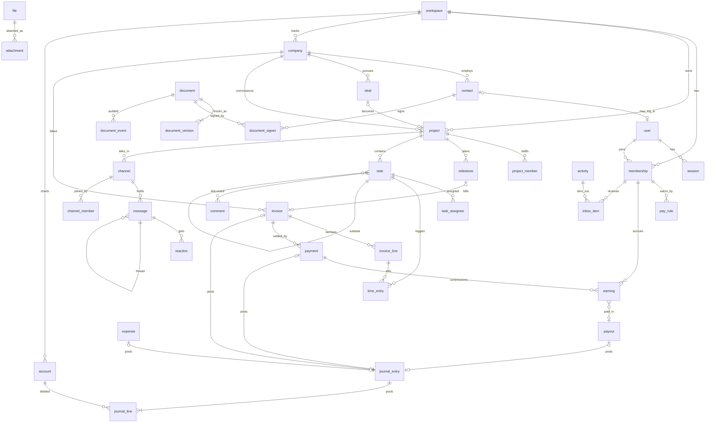

# Database

Schema for the Prismark app, written as markdown before any code. When Drizzle and D1 arrive, these files become the Drizzle schema one domain at a time. Every column is marked with how strict it is, so the first migration can be loose and the later ones tighten without rewriting the doc.

## Files

| File                         | Tables                                                                                                   |
| ---------------------------- | -------------------------------------------------------------------------------------------------------- |
| [auth.md](auth.md)           | user, login_attempt, session                                                                             |
| [workspace.md](workspace.md) | workspace, membership                                                                                    |
| [projects.md](projects.md)   | project, project_member, milestone                                                                       |
| [tasks.md](tasks.md)         | task, task_assignee, time_entry                                                                          |
| [chat.md](chat.md)           | channel, channel_member, message, reaction, channel_read                                                 |
| [crm.md](crm.md)             | company, contact, deal                                                                                   |
| [money.md](money.md)         | account, journal_entry, journal_line, invoice, invoice_line, payment, expense, pay_rule, earning, payout |
| [documents.md](documents.md) | document, document_version, document_signer, document_event                                              |
| [shared.md](shared.md)       | file, attachment, comment, activity, inbox_item                                                          |

## Conventions

**Database.** SQLite on Cloudflare D1. Column types are the four SQLite affinities: `text`, `integer`, `real`, `blob`. No `blob` is used; file bytes live in R2.

**Ids.** Every table has `id text` holding a ULID made in the app. Where people say a number out loud there is also a per-workspace sequence: `task.number`, `invoice.number`, `deal.number`. The next value of each sequence lives on the workspace row.

**Time.** All timestamps are `integer` unix milliseconds. Calendar days with no time of day, like a time entry's day, are `text` in `YYYY-MM-DD`.

**Booleans.** `integer` 0 or 1.

**Money.** Amounts are `integer` minor units, never floats. Every money column has a `currency text` sibling holding an ISO 4217 code. The ledger is kept in the workspace base currency; a line that crossed currencies also stores the original currency and amount. Percentages are `integer` basis points, so 16 percent is 1600.

**Every table** has `created_at` and `updated_at` unless the table is immutable, in which case only `created_at`. These two are not repeated in the column tables below.

**Deletion.** Tables that hold user content have `deleted_at` and are soft deleted. Money rows are never deleted; a wrong journal entry is reversed by a new one, a wrong invoice is voided.

**Workspace scoping.** `workspace_id` sits on root tables only: membership, project, task, channel, company, account, journal_entry, invoice, expense, document, file, activity. Everything else reaches its workspace through its parent.

**Enums.** Stored as `text`. The allowed values are listed in the column notes. They become check constraints when Drizzle arrives.

**Polymorphic pointers.** Exactly four tables point at "some row" with a `target_type text` plus `target_id text` pair: attachment, comment, activity, inbox_item. Each lists its allowed target types. Every other reference is a real foreign key.

**Strictness.** Each column carries one of three rules.

| Rule     | Meaning                                                                                                          |
| -------- | ---------------------------------------------------------------------------------------------------------------- |
| required | not null from the first migration                                                                                |
| optional | nullable by design, stays nullable                                                                               |
| later    | nullable in the first migration, becomes not null or gains its foreign key once the feature that fills it exists |

**Foreign keys.** A column named `<thing>_id` references `<thing>.id` unless the notes say otherwise. Columns like `created_by`, `author_id`, `actor_id`, `owner_id`, `reviewer_id`, `recorded_by`, `invited_by` reference `membership.id`, never `user.id`, because a person acts inside a workspace.

## Overview

## What the app never stores

- Passwords, password hashes, OAuth tokens for sign-in. Sign-in is an email code only.
- A self-service sign-up. Every user row is created by an existing member with permission, recorded in `membership.invited_by`.
- Card numbers or bank credentials. Stripe holds those; the app stores a provider reference.
- Money as floats.
